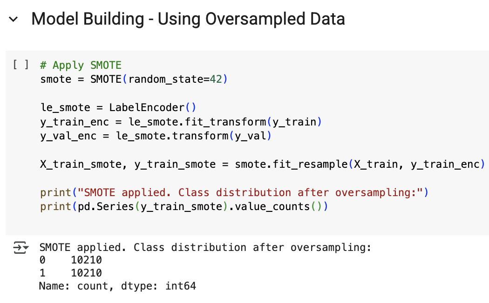
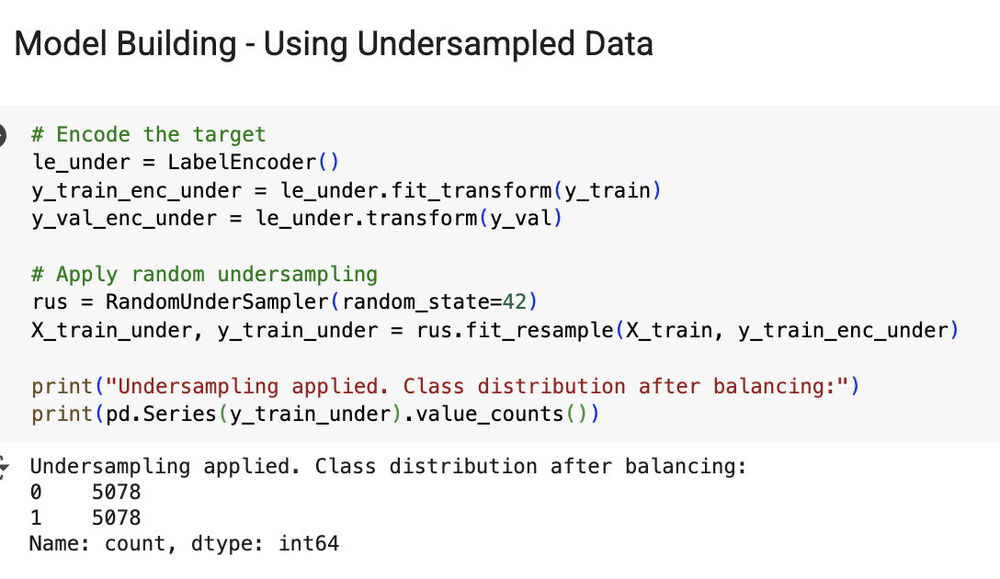

# 🛂 EasyVisa — Predicting Visa Case Outcomes with Machine Learning
*An advanced ML pipeline to automate visa application screening, optimize approvals, and generate data-driven insights for labor certification.*

---

## 📌 Problem Statement & Context

  

The U.S. visa application process is highly competitive, with significant socio-economic consequences for applicants and employers. Predicting the likelihood of visa case approval or denial can help streamline decision-making, reduce uncertainties, and guide applicants and organizations in preparing stronger submissions.

Manual reviews are **time-intensive**, creating bottlenecks in processing. To improve efficiency, OFLC partnered with **EasyVisa** to leverage **machine learning** to:
- Predict whether a visa application will be **Certified** or **Denied**.
- Identify key **predictors of approvals**.
- Support policymakers and employers with **data-driven decisions**.

The ultimate goal is to build models that not only achieve strong accuracy but also maintain balanced recall and precision, especially for the minority class (“Denied”), where misclassification could have serious implications.

---

## 🎯 Objective
Develop a **classification model** to predict visa case outcomes (`Certified` vs. `Denied`) and uncover insights into applicant and employer factors influencing decisions.

### Dataset Features
- **case_id**: Unique application ID  
- **continent**: Applicant’s continent of origin  
- **education_of_employee**: Education level (High School, Bachelor’s, Master’s, Doctorate)  
- **has_job_experience**: Prior work experience (Y/N)  
- **requires_job_training**: Whether job requires training (Y/N)  
- **no_of_employees**: Employer size  
- **yr_of_estab**: Year company established  
- **region_of_employment**: US region of employment  
- **prevailing_wage**: Benchmark wage for role  
- **unit_of_wage**: Hourly, Weekly, Monthly, Yearly  
- **full_time_position**: Full-time (Y/N)  
- **case_status**: Target variable (Certified/Denied)  

---

## 🔍 Exploratory Data Analysis (EDA)

### Key Findings

  

- **Education:** Approval probability rises with education — from **63% (Bachelor’s)** to **86% (Doctorate)**.  

  

- **Experience:** Experienced applicants had ~**75% approval**, compared to ~**50%** for non-experienced.  
- **Geography:**  
  - **Asia:** ~66% approval  
  - **Europe:** ~81% approval  
  - **US Midwest region:** ~75% approval (highest among regions).  
- **Training:** Requirement for training showed **minimal influence** on approval.  
- **Full-time vs. Part-time:** Both saw approval rates above **66%**.  
- **Company Metrics (size, year established, wages):** Had limited predictive power.  

---

# 🤖 Modeling Approach

**Models Tested:** 
The following algorithms were tested:
- Decision Tree – baseline interpretability
- Random Forest – ensemble for improved stability
- Bagging (Decision Trees) – variance reduction
- Gradient Boosting (GBM) – sequential learning with boosting
- AdaBoost – adaptive boosting to reduce bias
- XGBoost – optimized boosting with strong performance

**Imbalance Handling:**
The dataset was heavily skewed towards “Certified” cases. To address this:
- Original Dataset – models trained directly on raw data

  

- SMOTE (Synthetic Minority Oversampling Technique) – oversampled minority class

  

- Random Undersampling – reduced majority class
This ensured that models were not biased toward predicting only the majority class. 

**Evaluation Metrics:**
The dataset was imbalanced (more “Certified” than “Denied” cases). Accuracy alone would be misleading, so we focused on:
- F1 Score – balances precision and recall, chosen as the key metric.
- Recall – important to capture denied cases correctly.
- Precision – ensures predicted denials are credible.

**Why F1 Score?** It handles imbalance better than accuracy and balances the cost of false positives (unnecessary rejections) and false negatives (missed denials).

**Hyperparameter Tuning:** 
To improve model performance and prevent overfitting, hyperparameter tuning was applied to the boosting algorithms (Gradient Boosting, AdaBoost, XGBoost).
- GridSearchCV was used for smaller parameter spaces, exhaustively testing combinations.
- RandomizedSearchCV was used for larger spaces, providing faster exploration.

---

## 📊 Model Results 

| Model Variant                   | Accuracy | Precision | Recall | F1 Score |
|---------------------------------|----------|-----------|--------|----------|
| **SMOTE | Gradient Boosting**   | 0.7504   | 0.7210    | 0.6901 | **0.6996** |
| Gradient Boosting               | 0.7524   | 0.7254    | 0.6876 | 0.6981 |
| Undersampled | Gradient Boosting| 0.7155   | 0.6912    | 0.7084 | 0.6950 |
| SMOTE | AdaBoost                | 0.7347   | 0.6993    | 0.6838 | 0.6896 |
| SMOTE | XGBoost                 | 0.7374   | 0.7037    | 0.6770 | 0.6852 |
| Undersampled | XGBoost          | 0.6911   | 0.6747    | 0.6945 | 0.6749 |
| Random Forest                   | 0.7255   | 0.6883    | 0.6619 | 0.6695 |
| Decision Tree                   | 0.6652   | 0.6213    | 0.6200 | 0.6206 |

### 🏆 Final Model Chosen

  

**SMOTE with Gradient Boosting**  
- Achieved the **highest F1 Score (0.6996)**.  
- Balanced precision and recall better than all other models.  
- Outperformed plain Gradient Boosting and XGBoost on imbalanced data.  
- Selected as the final model for deployment.  

---

## 💡 Business Insights & Recommendations
1. **Prioritize Highly Educated Applicants**  
   - Doctorate and Master’s holders show the **highest approval rates**.  
   - Suggest fast-tracking highly educated workers to fill **specialized roles**.  

2. **Leverage Experience as a Key Driver**  
   - Work experience boosts approval by ~25 percentage points.  
   - Employers should emphasize relevant prior work when applying.  

3. **Regional Considerations**  
   - Midwest and South US regions have higher approval rates.  
   - Policymakers can encourage applications targeting these geographies.  

4. **Wage & Training Neutrality**  
   - Prevailing wages and training requirements had **little impact** on outcomes.  
   - Suggest policy efforts focus more on **skills & education** than wage adjustments.  

5. **Balanced Campaign Targeting**  
   - By using ML model scores, EasyVisa can rank applicants by **approval likelihood**.  
   - High-score applicants: **priority for manual review**.  
   - Low-score applicants: **automated processing** to save time.  
